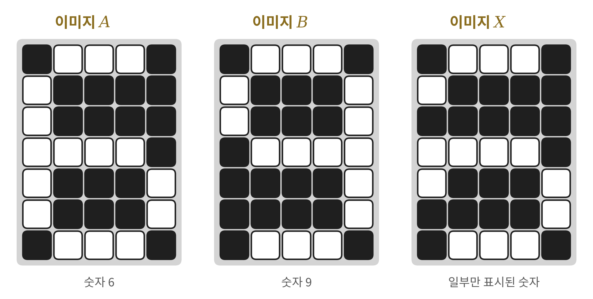
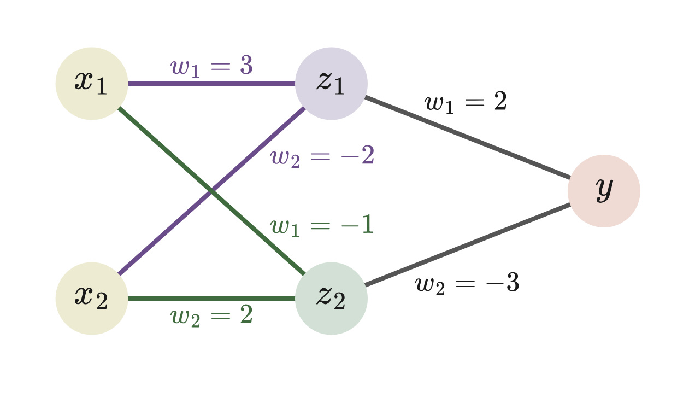
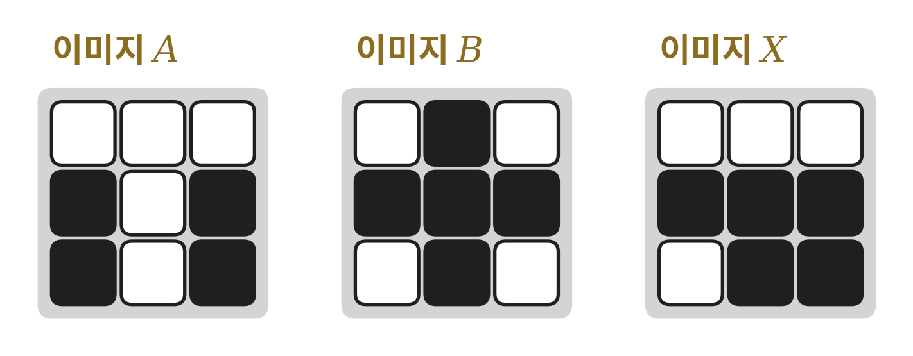
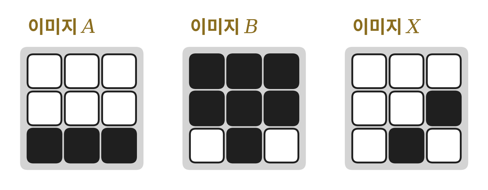

# 2026학년도 2학기 중간고사 — 인공지능 수학 (3학년)

선택형 25문항 · 50분 · 100점 만점 (3점 7문항 · 4점 11문항 · 5점 7문항)

> 답안은 모두 답안지(OMR)에 표시하시오. 계산 과정은 문제지의 여백을 활용할 수 있으며, 채점 대상에는 포함되지 않는다.

---

**1.** [3점] 두 영화 감상평 $P$, $Q$에 나오는 단어 '감동', '연기', '음악'의 빈도수를 성분으로 하는 벡터가 각각
$$\vec{P}=(3,\ 1,\ 4),\qquad \vec{Q}=(1,\ 4,\ 2)$$
일 때, 두 감상평의 유클리드 유사도 $L(P, Q)$의 값은?

① $3$  ② $\sqrt{13}$  ③ $4$  ④ $\sqrt{17}$  ⑤ $17$

---

**2.** [3점] 두 텍스트 $P$, $Q$를 구성하는 단어의 집합이 각각
$$P=\{\text{여행, 바다, 노을, 사진, 휴식}\},\qquad Q=\{\text{바다, 사진, 휴식, 맛집}\}$$
일 때, 두 텍스트의 자카드 유사도 $J(P, Q)$의 값은?

① $\dfrac{1}{3}$  ② $\dfrac{1}{2}$  ③ $\dfrac{3}{5}$  ④ $\dfrac{2}{3}$  ⑤ $\dfrac{3}{4}$

---

**3.** [3점] 다음은 두 명제 $x_1, x_2$에 대한 논리곱(AND)과 배타적 논리합(XOR)의 진리표이다.

| $x_1$ | $x_2$ | AND | XOR |
|:-:|:-:|:-:|:-:|
| 0 | 0 | 0 | 0 |
| 0 | 1 | ㉠ | ㉡ |
| 1 | 0 | 0 | 1 |
| 1 | 1 | ㉢ | ㉣ |

㉠+㉡+㉢+㉣의 값은?

① $0$  ② $1$  ③ $2$  ④ $3$  ⑤ $4$

---

**4.** [3점] 입력값 $x_1, x_2$에 대한 가중치가 $w_1=0.6$, $w_2=-0.4$이고, 활성화함수가
$$\sigma(x)=\begin{cases}0 & (x<0)\\ 5 & (x\ge 0)\end{cases}$$
인 퍼셉트론이 있다. $x_1=2$, $x_2=1$을 입력할 때, 각각의 입력값과 가중치를 곱한 값들의 합 $x$와 출력값 $\sigma(x)$에 대하여 $x+\sigma(x)$의 값은?

① $0.8$  ② $1.6$  ③ $5$  ④ $5.8$  ⑤ $6.6$

---

**5.** [3점] 성분이 0 또는 1인 $3\times3$ 행렬로 나타낸 두 이미지
$$P=\begin{pmatrix}1&0&1\\0&1&0\\1&1&0\end{pmatrix},\qquad Q=\begin{pmatrix}1&1&1\\0&0&0\\1&1&1\end{pmatrix}$$
의 해밍 거리 $H(P, Q)$의 값은?

① $3$  ② $4$  ③ $5$  ④ $6$  ⑤ $9$

---

**6.** [3점] 성분이 0 또는 1인 $3\times3$ 행렬로 나타낸 이미지 $A$, $B$의 해밍 거리 $H(A, B)$에 대한 설명으로 옳은 것만을 \<보기\>에서 있는 대로 고른 것은?

> ㄱ. $H(A, A)=0$이다.
> ㄴ. $H(A, B)=H(B, A)$이다.
> ㄷ. $H(A, B)$의 값이 클수록 두 이미지 $A$, $B$는 더 유사하다.

① ㄱ  ② ㄴ  ③ ㄷ  ④ ㄱ, ㄴ  ⑤ ㄱ, ㄴ, ㄷ

---

**7.** [3점] 성분이 0 또는 1인 행렬로 나타낸 이미지 $A$에 대하여, 입력되는 이미지가 $A$일 가능성을 계산하는 퍼셉트론 $\mathrm{P_A}$의 가중치 행렬을
$$W_A=\frac{1}{(\text{행렬 } A\text{의 모든 성분의 합})}A$$
로 정하고, 활성화함수를 $\sigma(x)=x$라 하자. 이에 대한 설명으로 옳은 것만을 \<보기\>에서 있는 대로 고른 것은?

> ㄱ. 이미지 $A$ 자신을 입력하면 출력값은 1이다.
> ㄴ. 어떤 이미지를 입력하더라도 출력값은 0 이상 1 이하이다.
> ㄷ. 두 이미지 $A$, $B$에 대한 퍼셉트론 $\mathrm{P_A}$, $\mathrm{P_B}$의 출력값 중 더 작은 쪽의 이미지로 분류한다.

① ㄱ  ② ㄴ  ③ ㄱ, ㄴ  ④ ㄱ, ㄷ  ⑤ ㄱ, ㄴ, ㄷ

---

**8.** [4점] 두 텍스트 $P$, $Q$를 나타내는 벡터가
$$\vec{P}=(1,\ 2,\ 2),\qquad \vec{Q}=(2,\ 3,\ 6)$$
일 때, 두 텍스트의 코사인 유사도 $C(P, Q)$의 값은?

① $\dfrac{2}{3}$  ② $\dfrac{20}{21}$  ③ $1$  ④ $2$  ⑤ $20$

---

**9.** [4점] 세 학생 $A$, $B$, $C$가 네 가지 동아리 활동 '밴드, 영화, 축구, 코딩'에 대한 선호도를 1위부터 4위까지 순위로 매긴 결과가 다음과 같다.

| | 밴드 | 영화 | 축구 | 코딩 |
|:-:|:-:|:-:|:-:|:-:|
| $A$ | 1 | 2 | 3 | 4 |
| $B$ | 2 | 1 | 4 | 3 |
| $C$ | 4 | 3 | 1 | 2 |

각 학생의 선호도를 (밴드의 순위, 영화의 순위, 축구의 순위, 코딩의 순위)와 같은 벡터로 나타낼 때, 코사인 유사도를 이용하여 판단한 선호도가 가장 유사한 두 학생의 코사인 유사도의 값은?

① $\dfrac{7}{10}$  ② $\dfrac{4}{5}$  ③ $\dfrac{13}{15}$  ④ $\dfrac{9}{10}$  ⑤ $\dfrac{14}{15}$

---

**10.** [4점] 다음은 단어 사전 $U=\{$금리, 주가, 공연, 수출, 전시$\}$에 대하여 경제 기사, 문화 기사, 그리고 새로운 기사 $X$에 나오는 단어의 빈도수를 나타낸 것이다.

| | 금리 | 주가 | 공연 | 수출 | 전시 |
|:-:|:-:|:-:|:-:|:-:|:-:|
| 경제 기사 | 3 | 2 | 0 | 1 | 0 |
| 문화 기사 | 0 | 1 | 3 | 0 | 2 |
| 기사 $X$ | 2 | 2 | 1 | 0 | 1 |

유클리드 유사도를 이용하여 기사 $X$를 경제 기사 또는 문화 기사로 분류할 때, 분류 결과와 그때의 유클리드 유사도의 값을 순서대로 나열한 것은?

① 경제 기사, $2$  ② 경제 기사, $\sqrt{10}$  ③ 경제 기사, $4$  ④ 문화 기사, $2$  ⑤ 문화 기사, $\sqrt{10}$

---

**11.** [4점] 입력값 $x_1, x_2$에 대한 가중치가 $w_1=0.3$, $w_2=-0.5$이고, 활성화함수가
$$\sigma(x)=\begin{cases}0 & (x<0)\\ 2 & (x\ge 0)\end{cases}$$
인 퍼셉트론이 있다. 다음은 주어진 입력값에 대하여 각각의 입력값과 가중치를 곱한 값들의 합 $x$와 출력값 $\sigma(x)$를 나타낸 표이다.

| $x_1$ | $x_2$ | $x$ | $\sigma(x)$ |
|:-:|:-:|:-:|:-:|
| 0 | 0 | 0 | ㉡ |
| 0 | 1 | ㉠ | 0 |
| 1 | 0 | 0.3 | 2 |
| 1 | 1 | ㉢ | 0 |

㉠+㉡+㉢의 값은?

① $-0.7$  ② $1.3$  ③ $1.7$  ④ $2.3$  ⑤ $2.7$

---

**12.** [4점] 입력값 $x_1, x_2$에 대한 가중치가 $w_1=4$, $w_2=3$이고, 활성화함수가
$$\sigma(x)=\begin{cases}0 & (x<h)\\ 1 & (x\ge h)\end{cases}$$
인 퍼셉트론이 논리합(OR) 연산을 수행하도록 하는 임곗값 $h$의 값의 범위는?

① $0<h<3$  ② $0\le h\le 3$  ③ $0<h\le 4$  ④ $3<h\le 7$  ⑤ $0<h\le 3$

---

**13.** [4점] 입력값 $x_1, x_2$에 대한 가중치가 $w_1=-4$, $w_2=-2$이고, 활성화함수가
$$\sigma(x)=\begin{cases}0 & (x<h)\\ 1 & (x\ge h)\end{cases}$$
인 퍼셉트론이 있다. 이 퍼셉트론의 출력값이 다음 표와 같도록 하는 정수 $h$의 개수는?

| $x_1$ | $x_2$ | $\sigma(x)$ |
|:-:|:-:|:-:|
| 0 | 0 | 1 |
| 0 | 1 | 0 |
| 1 | 0 | 0 |
| 1 | 1 | 0 |

① $1$  ② $2$  ③ $3$  ④ $4$  ⑤ $5$

---

**14.** [4점] 입력값 $x_1, x_2$에 대한 가중치가 $w_1, w_2$이고, 활성화함수가
$$\sigma(x)=\begin{cases}0 & (x<1)\\ 1 & (x\ge 1)\end{cases}$$
인 퍼셉트론에 대한 설명으로 옳은 것만을 \<보기\>에서 있는 대로 고른 것은?

> ㄱ. $w_1=0.6$, $w_2=0.6$이면 이 퍼셉트론은 논리곱(AND) 연산을 수행한다.
> ㄴ. $w_1=1$, $w_2=1$이면 이 퍼셉트론은 논리곱(AND) 연산을 수행한다.
> ㄷ. $w_1, w_2$의 값을 어떻게 정하더라도 이 퍼셉트론은 배타적 논리합(XOR) 연산을 수행할 수 없다.

① ㄱ  ② ㄴ  ③ ㄱ, ㄷ  ④ ㄴ, ㄷ  ⑤ ㄱ, ㄴ, ㄷ

---

**15.** [4점] 성분이 0 또는 1인 $3\times3$ 행렬로 나타낸 네 이미지가 다음과 같다.
$$A=\begin{pmatrix}1&1&1\\1&0&1\\1&1&1\end{pmatrix},\quad B=\begin{pmatrix}0&1&0\\0&1&0\\0&1&0\end{pmatrix},\quad C=\begin{pmatrix}1&0&1\\0&1&0\\1&0&1\end{pmatrix}$$
$$X=\begin{pmatrix}0&1&0\\1&1&1\\0&1&0\end{pmatrix}$$
해밍 거리를 이용하여 세 이미지 $A$, $B$, $C$ 중에서 이미지 $X$와 가장 유사한 이미지를 찾을 때, 그 이미지와 그때의 해밍 거리를 순서대로 나열한 것은?

① $A$, $2$  ② $B$, $2$  ③ $B$, $3$  ④ $C$, $1$  ⑤ $C$, $8$

---

**16.** [4점] 가로와 세로의 픽셀 수가 각각 5와 7인 전광판에 표시된 두 숫자 6과 9의 이미지 $A$, $B$와, 몇 개의 전구에 불이 들어오지 않아 일부만 표시된 어떤 숫자의 이미지 $X$가 다음 그림과 같다.

불이 켜진 픽셀을 1, 꺼진 픽셀을 0으로 하여 세 이미지를 행렬로 나타낸 뒤 해밍 거리를 이용할 때, 이미지 $X$가 6과 9 중 어느 숫자로 분류되는지와 그때의 해밍 거리를 순서대로 나열한 것은?

① 6, $2$  ② 6, $4$  ③ 9, $2$  ④ 9, $4$  ⑤ 9, $6$

---

**17.** [4점] 성분이 0 또는 1인 $2\times3$ 행렬로 나타낸 이미지
$$A=\begin{pmatrix}1&1&0\\1&0&1\end{pmatrix}$$
에 대하여, 입력되는 이미지가 $A$일 가능성을 계산하는 퍼셉트론의 가중치 행렬을 $W=\dfrac{1}{(\text{행렬 } A\text{의 모든 성분의 합})}A$로 정하고, 활성화함수를 $\sigma(x)=x$라 하자. 이 퍼셉트론에 이미지
$$X=\begin{pmatrix}1&1&1\\1&0&1\end{pmatrix}$$
을 입력할 때, 출력값은?

① $\dfrac{1}{4}$  ② $\dfrac{1}{2}$  ③ $\dfrac{3}{4}$  ④ $1$  ⑤ $4$

---

**18.** [4점] 다음 표는 어느 지역의 연도별 전기차 등록 대수를 나타낸 것인데, 2022년의 자료가 누락되었다. 연도를 $x$년, 등록 대수를 $y$천 대라 하고 추세선의 식을 $f(x)=12(x-2019)+15$라 하자.

| 연도(년) | 2019 | 2020 | 2021 | 2022 | 2023 | 2024 |
|:-:|:-:|:-:|:-:|:-:|:-:|:-:|
| 등록 대수(천 대) | 14 | 28 | 40 | | 60 | 76 |

누락된 2022년의 등록 대수의 예측값을 $p$, 2023년의 등록 대수의 측정값과 예측값 사이의 오차를 $q$라 할 때, $p+q$의 값은?

① $48$  ② $51$  ③ $54$  ④ $60$  ⑤ $66$

---

**19.** [5점] 입력값 $x_1, x_2$에 대한 가중치가 $w_1, w_2$이고, 활성화함수가
$$\sigma(x)=\begin{cases}0 & (x<5)\\ 1 & (x\ge 5)\end{cases}$$
인 퍼셉트론이 있다. $w_1=2$일 때, 이 퍼셉트론이 논리곱(AND) 연산을 수행하도록 하는 모든 정수 $w_2$의 값의 합은?

① $3$  ② $4$  ③ $7$  ④ $9$  ⑤ $12$

---

**20.** [5점] 그림과 같은 다층 퍼셉트론에서 활성화함수는
$$\sigma(x)=\begin{cases}0 & (x<0)\\ 1 & (x\ge 0)\end{cases}$$
이고, 은닉층의 값 $z_1, z_2$와 출력값 $y$는
$$z_1=\sigma(3x_1-2x_2),\quad z_2=\sigma(-x_1+2x_2),\quad y=\sigma(2z_1-3z_2)$$
이다.

다음 네 쌍의 입력값 $x_1, x_2$ 중 출력값 $y$가 1이 되는 것의 개수는?

| $x_1$ | $x_2$ |
|:-:|:-:|
| 2 | 1 |
| 1 | −1 |
| −1 | 2 |
| −1 | −1 |

① $0$  ② $1$  ③ $2$  ④ $3$  ⑤ $4$

---

**21.** [5점] 그림과 같은 다층 퍼셉트론에서 활성화함수는
$$\sigma(x)=\begin{cases}0 & (x<4)\\ 1 & (x\ge 4)\end{cases}$$
이고, 은닉층의 값 $z_1, z_2$와 출력값 $y$는
$$z_1=\sigma(6x_1+5x_2),\quad z_2=\sigma(3x_1+2x_2),\quad y=\sigma(5z_1+k\,z_2)$$
이다.

이 다층 퍼셉트론이 배타적 논리합(XOR) 연산을 수행하도록 하는 정수 $k$의 최댓값은?

① $-6$  ② $-5$  ③ $-4$  ④ $-3$  ⑤ $-2$

---

**22.** [5점] 성분이 0 또는 1인 $3\times3$ 행렬로 나타낸 두 이미지
$$P=\begin{pmatrix}1&0&1\\0&1&0\\1&0&1\end{pmatrix},\qquad Q=\begin{pmatrix}1&a&1\\0&1&b\\0&0&1\end{pmatrix}$$
에 대하여 $H(P, Q)=3$일 때, $a, b$의 값은?

① $a=0,\ b=0$  ② $a=0,\ b=1$  ③ $a=1,\ b=0$  ④ $a=1,\ b=1$  ⑤ 조건을 만족시키는 $a, b$는 존재하지 않는다.

---

**[23~24]** 성분이 0 또는 1인 행렬로 나타낸 이미지 $A$에 대하여, 입력되는 이미지가 $A$일 가능성을 계산하는 퍼셉트론 $\mathrm{P_A}$의 가중치 행렬은
$$W_A=\frac{1}{(\text{행렬 } A\text{의 모든 성분의 합})}A$$
이고, 활성화함수는 $\sigma(x)=x$이다. 물음에 답하시오.

**23.** [5점] 성분이 0 또는 1인 $3\times3$ 행렬로 나타낸 세 이미지 $A$, $B$, $X$가 그림과 같다.

이미지 $X$를 두 퍼셉트론 $\mathrm{P_A}$, $\mathrm{P_B}$에 입력할 때, 인공지능이 $X$를 어느 이미지로 분류하는지와 그때의 출력값을 순서대로 나열한 것은?

① $A$, $\dfrac{3}{4}$  ② $A$, $\dfrac{4}{5}$  ③ $B$, $\dfrac{3}{4}$  ④ $B$, $\dfrac{4}{5}$  ⑤ $B$, $1$

---

**24.** [5점] 성분이 0 또는 1인 $3\times3$ 행렬로 나타낸 세 이미지 $A$, $B$, $X$가 그림과 같다.

이미지 $X$를 두 이미지 $A$, $B$ 중 하나로 분류하려고 한다. 옳은 것만을 \<보기\>에서 있는 대로 고른 것은?

> ㄱ. $H(X, A)=3$이다.
> ㄴ. 퍼셉트론 $\mathrm{P_A}$의 출력값은 퍼셉트론 $\mathrm{P_B}$의 출력값보다 작다.
> ㄷ. 해밍 거리를 이용하든 두 퍼셉트론 $\mathrm{P_A}$, $\mathrm{P_B}$를 이용하든 $X$는 모두 $A$로 분류된다.

① ㄱ  ② ㄷ  ③ ㄱ, ㄴ  ④ ㄱ, ㄷ  ⑤ ㄱ, ㄴ, ㄷ

---

**25.** [5점] 다음 표는 어느 카페에서 낮 최고 기온에 따른 아이스 음료 판매량을 조사한 것이다. 기온을 $x\,°\mathrm{C}$, 판매량을 $y$잔이라 하고 추세선의 식을 $f(x)=5x+20$이라 하자.

| 기온($°\mathrm{C}$) | 20 | 24 | 28 | 32 |
|:-:|:-:|:-:|:-:|:-:|
| 판매량(잔) | 118 | 144 | 155 | 183 |

네 자료 중 오차의 크기가 가장 큰 자료의 오차는?

① $-5$  ② $-2$  ③ $3$  ④ $4$  ⑤ $5$

---
